# 🤖 Telegram Бот для Рассылок в Группы и Каналы

Мой Telegram бот, предназначенный для автоматизации процесса отправки запланированных сообщений в несколько Telegram-каналов и групп. Он предоставляет удобный интерфейс для создания, управления и запуска задач рассылки.

## ⚠️ Важная информация

- Бот полностью поддерживает рассылку сообщений как в **каналы**, так и в **группы**.

- Для того чтобы рассылка работала Вам необходимо добавить Бота в Канал/Группу и сделать его там Администратором с правами на **Управление сообщениями**.

- Использование в незаконных/неэтичных целях вы берете строго на себя!Автор не несет отвественности за Ваш use-case.

> Также приветствуется создание **issues** и ваши идеи по добавлению/исправлению функционала!

## 👨🏻‍💻 Результаты работы

<div style="display: flex; justify-content: center">
  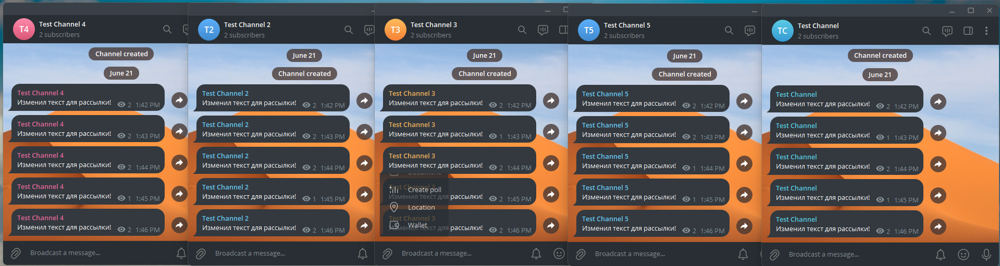
</div>

## ✨ Возможности

- **Создание и управление задачами**: Легко настраивайте сообщение, определяйте интервал отправки и указывайте список целевых каналов.
- **Гибкое управление каналами**: Добавляйте, удаляйте или полностью заменяйте список каналов для вашей рассылки с отображением их названий.
- **Контроль запуска и остановки**: Полный контроль над процессами запуска и остановки рассылки через меню или команды.
- **Статус задачи**: Возможность в любой момент посмотреть детали задачи и её статус (работает рассылка или нет).
- **Безопасный доступ**: Бот доступен только для заранее определенного списка доверенных пользователей.
- **Многопоточность**: Бот использует отдельный поток для отправки сообщений, что гарантирует отзывчивость основного интерфейса.

## 🚀 Установка и запуск

1.  **Клонируйте репозиторий:**

    ```bash
    git clone https://github.com/your-username/notify-sender-bot.git
    cd notify-sender-bot
    ```

2.  **Установите зависимости:**

    ```bash
    pip install -r requirements.txt
    ```

3.  **Настройте бота:**

    - Создайте файл `tg_token.py` и добавьте в него `TOKEN = "ВАШ_ТЕЛЕГРАМ_ТОКЕН"`.
    - Создайте файл `trusted_users.txt` в корневой директории и добавьте в него имена пользователей Telegram, которым разрешено использовать бота (одно имя пользователя на строку, без символа @).

4.  **Запустите бота:**
    ```bash
    python bot.py
    ```

---

## 🛠️ Как использовать

### 1. Начальная настройка: Каналы, группы и права бота

---

Для начала вам нужно создать канал или группу в Telegram, добавить в нее вашего бота в качестве администратора и получить ID.

1.  **Создайте канал/группу**: Создайте новый публичный или частный канал/группу в Telegram.

2.  **Добавьте бота в администраторы**: Перейдите в настройки вашего канала или группы, затем в "Администраторы" и добавьте вашего бота. Предоставьте ему право на "Публикацию сообщений".

<div style="display: flex; justify-content: center; gap: 10px;">
  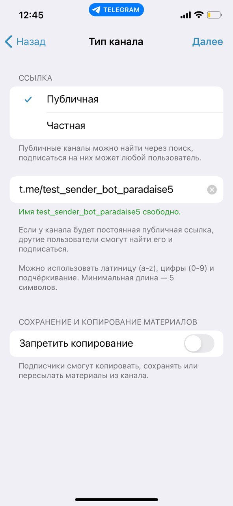
  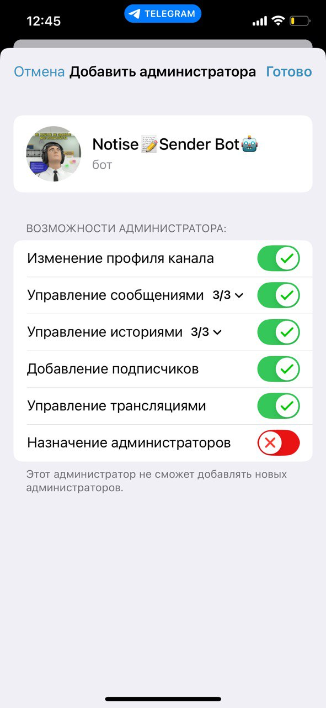
</div>

3.  **Получите ID**: Боту нужен уникальный ID для каждого канала или группы, чтобы отправлять сообщения. Вы можете получить этот ID у ботов, таких как `@username_to_id_bot`.

- Его можно получить в Веб-клиенте Телеграм, или воспользоваться ботом `IDBot` (`@username_to_id_bot`), который предоставляет удобный сервис для получения ID.

- Перейдите в бота **@username_to_id_bot**, нажмите соответствующую кнопку ("Channel" или "Group") и добавьте ваш чат. Бот вернет вам его идентификатор.

<div style="display: flex; justify-content: center;  gap: 5px;">
  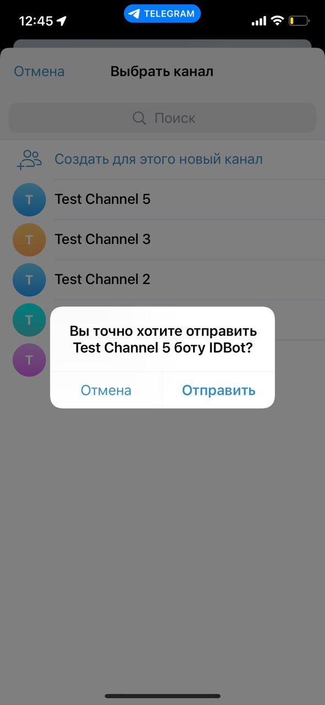
  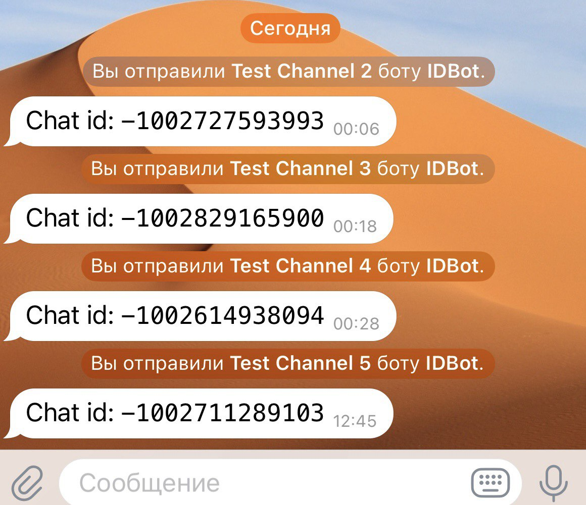
</div>

### 2. Взаимодействие с ботом

Вы можете управлять ботом как с помощью кнопок меню, так и с помощью команд.

#### 📜 Команды

- `/start` - Запустить бота и показать главное меню.
- `/help` - Показать справочное сообщение.
- `/show_task` - Показать детали текущей задачи и её статус.
- `/start_notify` - Запустить рассылку.
- `/stop_notify` - Остановить рассылку.

### Основной процесс

#### **▶️ Начало общения**: Зайдите в бота или введите команду `/start`

<div style="display: flex; justify-content: center; gap: 10px;">
  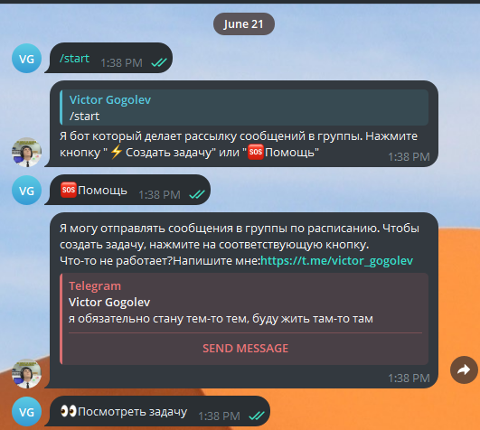
</div>

#### **📝 Создание задачи**: В главном меню нажмите **"⚡️Создать задачу"**. Бот последовательно запросит текст сообщения, интервал отправки в минутах и ID каналов для рассылки.

<div style="display: flex; justify-content: center; gap: 10px;">
  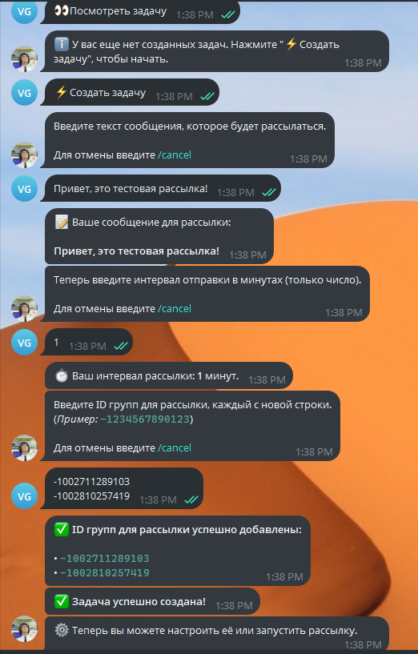
</div>

#### **⚙️ Изменение задачи**: В меню настроек вы можете изменить текст сообщения, интервал или список каналов. При изменении списка каналов бот покажет их текущие названия.

##### 1. Изменение текста сообщения/интервала рассылки

Вы можете поменять текст сообщения и интервал его отправки. Время задается в минутах.

<div style="display: flex; justify-content: center; gap: 10px;">
  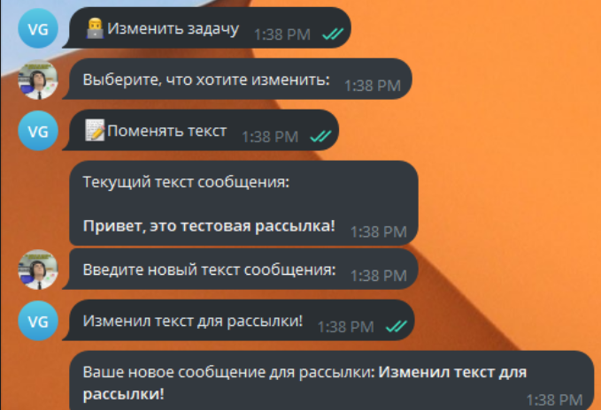
  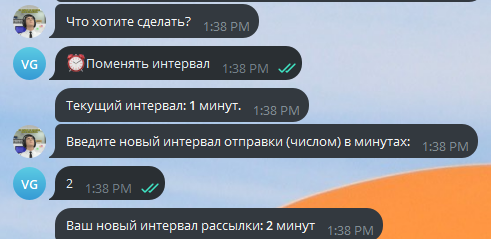
</div>

##### 2. Изменение списка каналов рассылки

Если при редактировании выбрать "Поменять список групп" -> "Заменить список", вы можете вставить полностью новый список для рассылки (старые записи будут удалены).

<p align="center">
  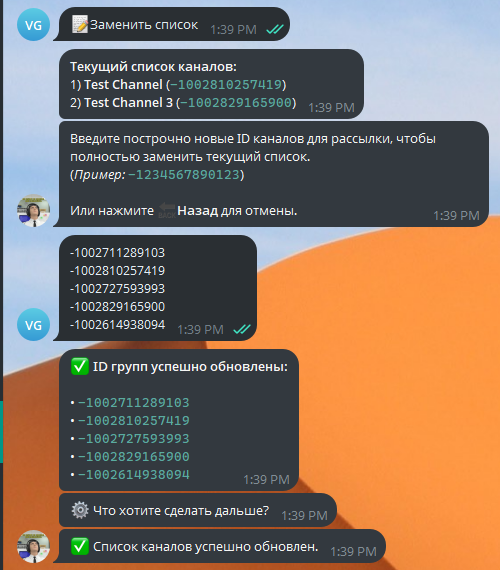
</p>

##### 3. Удаление/добавление каналов в список

Если выбрать "Поменять список групп" -> "Добавить/удалить группы", вы можете изменять текущий список каналов, добавляя или удаляя ID по одному в строке. Дубликаты будут автоматически удалены.

<div style="display: flex; justify-content: center; gap: 10px;">
  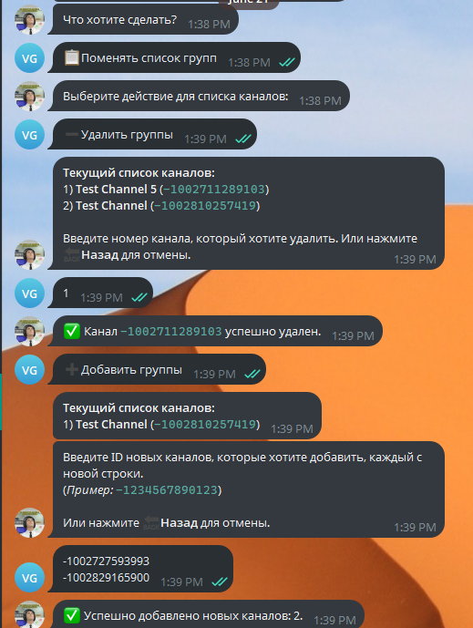
  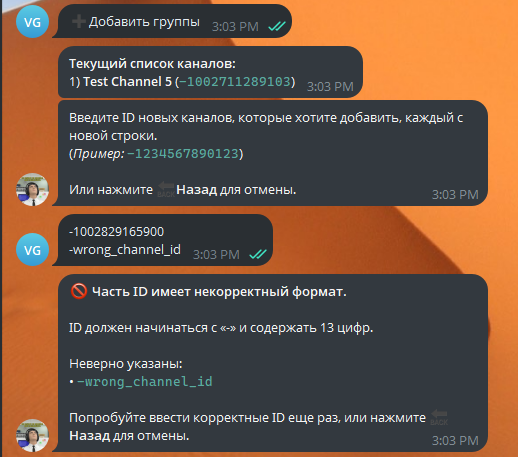
</div>

#### **Посмотр задачи**: Нажмите **"👀Посмотреть задачу"** или используйте команду `/show_task`, чтобы увидеть текущее сообщение, интервал, статус рассылки и список каналов с их названиями.

<div style="display: flex; justify-content: center; gap: 10px;">
  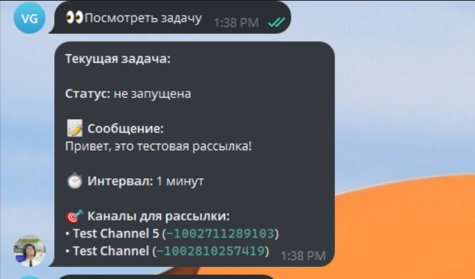
  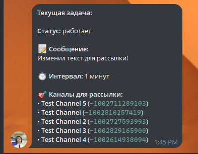
</div>

#### **Запуск и остановка**: Используйте кнопки **"🐇Начать рассылку"** и **"⏹Остановить рассылку"** или команды `/start_notify` и `/stop_notify`.

## 🎨 Интерфейс

### Главное меню

<p align="center">
  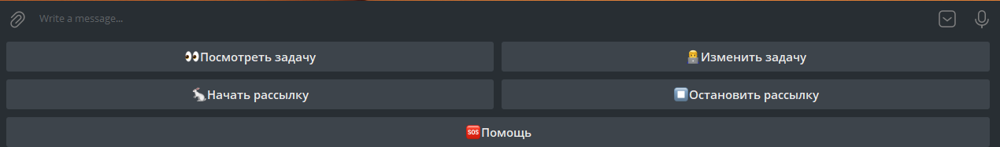
</p>

### Меню изменения заданий

<p align="center">
  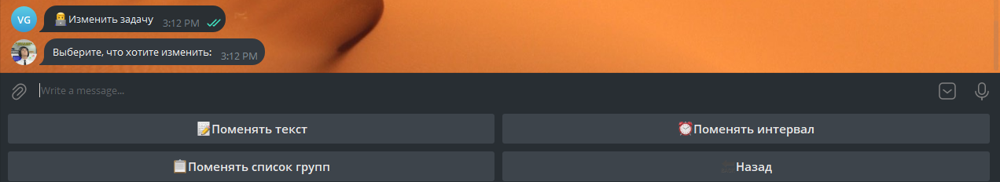
</p>

### Меню изменения списка каналов

<p align="center">
  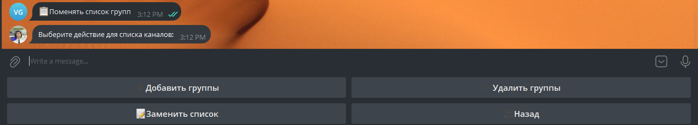
</p>

## 📈 Планы по развитию

Проект активно развивается. В планах добавить следующие возможности:

- **Удаление по диапазону**: Указывать при удалении каналов из списка сразу срез (диапазон), а не по одному.
- **Сохранение в БД**: Переход на базу данных (например, PostgreSQL) для хранения конфигураций задач и настроек. Это позволит создавать несколько независимых задач.
- **Поддержка медиа**: Возможность отправлять не только текстовые сообщения, но и фотографии, видео и документы.
- **Группировка каналов**: Реализация функционала для объединения каналов в именованные группы для удобного управления рассылками (например, "Новости", "Реклама").
- **Управление группами**: Добавление интерфейса для создания, редактирования и удаления групп каналов.
